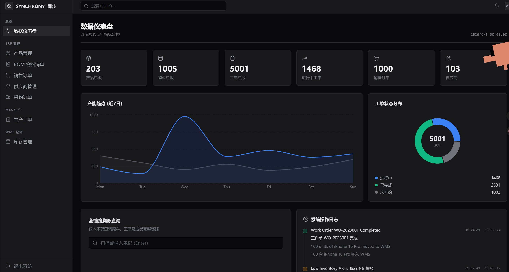
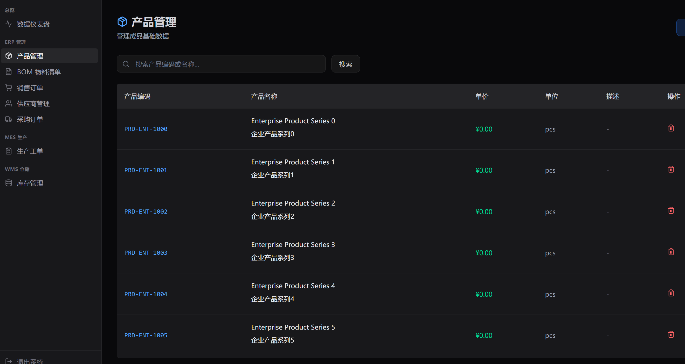
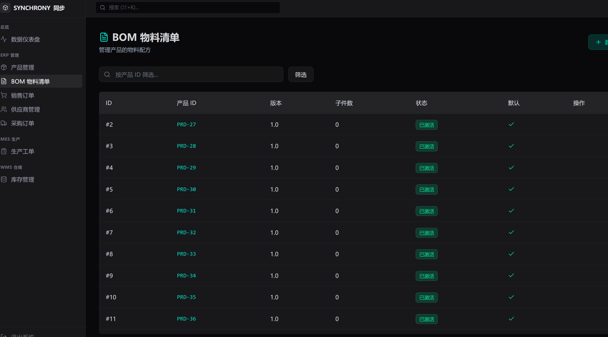
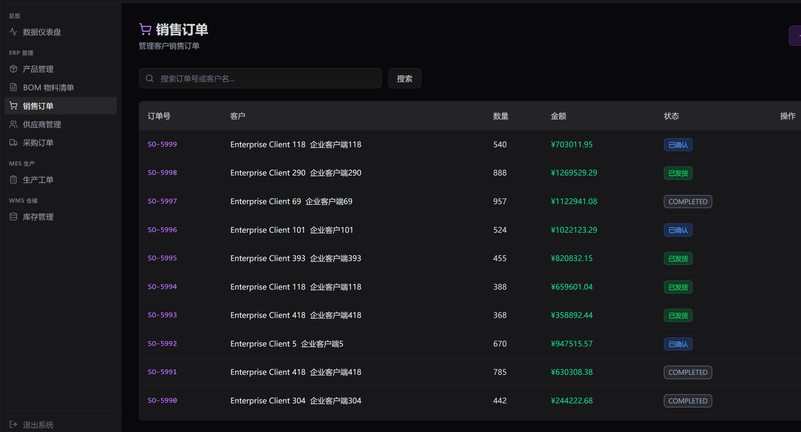
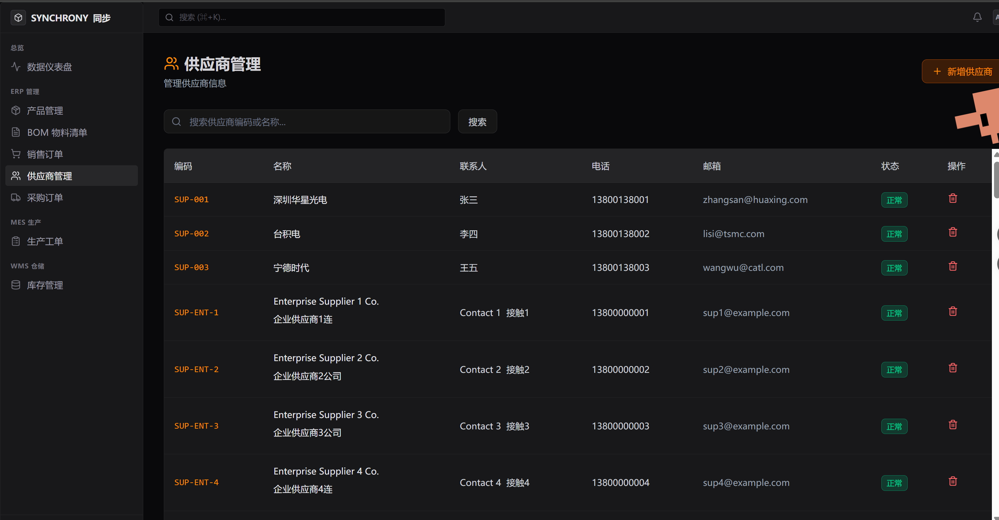
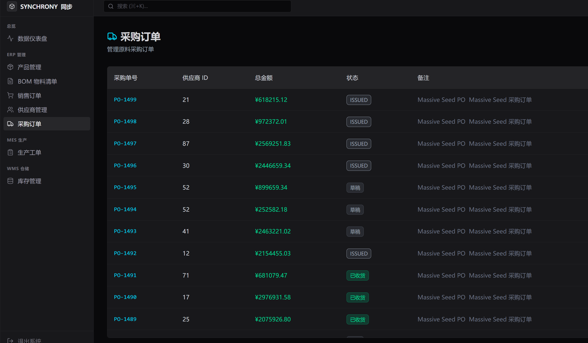
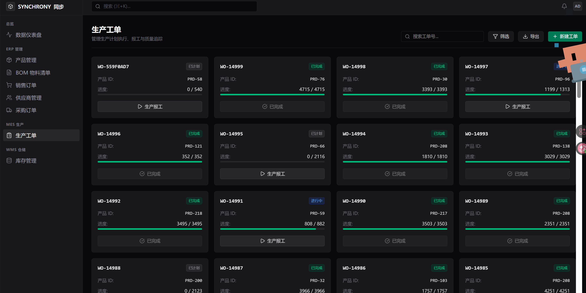
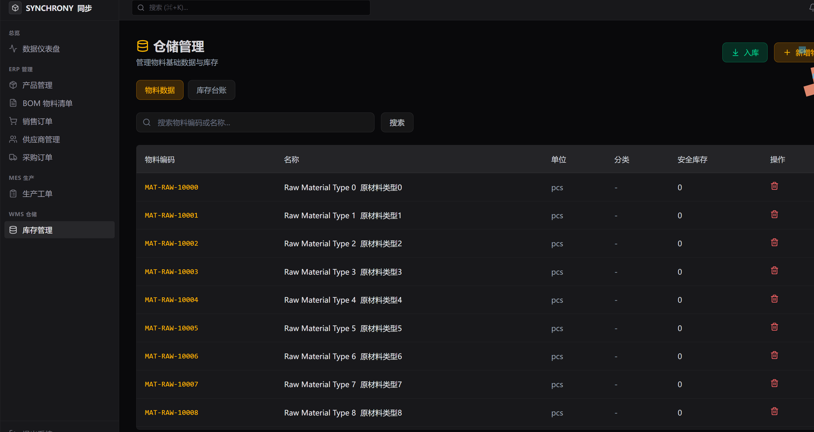

# ERP-MES-WMS 联动系统 (企业级多语言全链路制造与仓储管理系统)

企业级制造业信息化核心管理系统，全面打通 **ERP（企业资源计划）**、**MES（制造执行系统）**、**WMS（仓储管理系统）** 的数据孤岛，实现销售、采购、生产、库存、发货、溯源的全链路闭环联动。

> **核心价值**：销售订单确认后自动下发生产工单；MES 生产报工时通过**事件驱动**或**事务机制**自动扣减原料库存、增加成品库存，并生成批次溯源记录；WMS 出库发货时自动核销成品库存。三大系统数据实时共享、行级锁防并发，为企业数字化转型提供坚实的系统底座。

---

## 目录
- [1. 系统预览](#1-系统预览)
- [2. 系统架构](#2-系统架构)
  - [2.1 Go 后端架构 (高并发事件驱动版)](#21-go-后端架构-高并发事件驱动版)
  - [2.2 Python 后端架构 (经典业务/异步报表版)](#22-python-后端架构-经典业务异步报表版)
  - [2.3 共享前端 (React 19 SPA)](#23-共享前端-react-19-spa)
- [3. 核心业务流程与联动逻辑](#3-核心业务流程与联动逻辑)
  - [3.1 销售到交付流程 (Order-to-Delivery)](#31-销售到交付流程-order-to-delivery)
  - [3.2 生产与库存联动逻辑](#32-生产与库存联动逻辑)
  - [3.3 采购到入库流程 (Procure-to-Pay)](#33-采购到入库流程-procure-to-pay)
  - [3.4 全链路溯源图谱 (Traceability Map)](#34-全链路溯源图谱-traceability-map)
- [4. 设计深度剖析 (Deep Dives)](#4-设计深度剖析-deep-dives)
  - [4.1 并发与数据一致性控制](#41-并发与数据一致性控制)
  - [4.2 接口与操作的幂等性设计](#42-接口与操作的幂等性设计)
  - [4.3 BOM 物料防循环引用算法](#43-bom-物料防循环引用算法)
  - [4.4 RBAC 权限模型与 Casbin 控制](#44-rbac-权限模型与-casbin-控制)
  - [4.5 Celery 异步任务与 ReportLab 中文 PDF 报表](#45-celery-异步任务与-reportlab-中文-pdf-报表)
  - [4.6 可观测性系统 (Jaeger Trace + Prometheus Metrics)](#46-可观测性系统-jaeger-trace--prometheus-metrics)
- [5. 数据库设计与实体关系 (ERD)](#5-数据库设计与实体关系-erd)
  - [5.1 ER 关系图](#51-er-关系图)
  - [5.2 核心数据表清单](#52-核心数据表清单)
- [6. API 端点清单](#6-api-端点清单)
  - [6.1 Go 后端 API 接口 (Gin)](#61-go-后端-api-接口-gin)
  - [6.2 Python 后端 API 接口 (FastAPI)](#62-python-后端-api-接口-fastapi)
- [7. 项目目录结构](#7-项目目录结构)
- [8. 快速启动与部署指南](#8-快速启动与部署指南)
  - [8.1 基础设施部署](#81-基础设施部署)
  - [8.2 Go 后端启动运行](#82-go-后端启动运行)
  - [8.3 Python 后端与 Celery 启动运行](#83-python-后端与-celery-启动运行)
  - [8.4 React 前端启动运行](#84-react-前端启动运行)
  - [8.5 生产环境一键部署 (Docker Compose)](#85-生产环境一键部署-docker-compose)
- [9. 开发规范与最佳实践](#9-开发规范与最佳实践)
- [10. 更新日志 (2026年6月)](#10-更新日志-2026年6月)
- [11. 许可证 (License)](#11-许可证-license)

---

## 1. 系统预览

| 仪表盘                  | 产品管理                  | 生产工单                  |
|:--------------------:|:---------------------:|:---------------------:|
|  |  |  |
| **BOM 物料清单**         | **销售订单**              | **库存管理**              |
|  |  |    |
| **供应商**              | **溯源图谱**              |                       |
|  |    |                       |

---

## 2. 系统架构

本系统提供了**双后端技术栈实现**。这两种实现共享相同的数据库表逻辑和前端 SPA 控制台，分别展示了不同的系统设计哲学：

```
                           ┌────────────────────────────────────────────────────────┐
                           │                     前端 React 19 SPA                   │
                           │       暗色 UI · TailwindCSS 4 · React Flow 溯源图谱      │
                           └──────────────────────────┬─────────────────────────────┘
                                                      │ (HTTP/RESTful)
                                                      ▼
                      ┌──────────────────────────────────────────────────────────────┐
                      │                        Nginx 反向代理                         │
                      └──────────────┬──────────────────────────────┬────────────────┘
                                     │ (API Route 8080)             │ (API Route 8000)
                                     ▼                              ▼
                 ┌──────────────────────────────────────┐       ┌──────────────────────────────────────┐
                 │       【Go 后端 (事件驱动版)】        │       │       【Python 后端 (经典业务版)】    │
                 │   Gin · Uber Fx · Ent ORM · Casbin   │       │ FastAPI · SQLAlchemy · Alembic · JWT  │
                 └──────────┬───────────┬───────────────┘       └──────────┬───────────┬───────────────┘
                            │           │                                  │           │
                     (Kafka)│           │(SQLite)                  (Celery)│           │(Postgres)
                            ▼           ▼                                  ▼           ▼
                      ┌───────────┐┌───────────┐                     ┌───────────┐┌───────────┐
                      │Kafka 队列 ││ SQLite DB │                     │Celery(Redis) PostgreSQL│
                      │ 异步处理  ││ (erp.db)  │                     │ PDF报表生成││ 主数据库  │
                      └───────────┘└───────────┘                     └───────────┘└───────────┘
                            ▲                                              ▲
                            │ OpenTelemetry                                │ PDF 报表
                            ▼                                              │
                      ┌───────────┐                                  ┌───────────┐
                      │ Jaeger    │                                  │ 本地储存  │
                      │ Prometheus│                                  │  /reports │
                      └───────────┘                                  └───────────┘
```

### 2.1 Go 后端架构 (高并发事件驱动版)

Go 后端以 **高吞吐量、低延迟、松耦合、可观测性** 为设计导向，采用 Clean Architecture（清洁/六边形架构）分层，并融入了 DDD（领域驱动设计）的思想：
*   **Web 框架**：[Gin 1.12](https://github.com/gin-gonic/gin) 高性能路由路由和中间件调度。
*   **控制反转/依赖注入**：[Uber Fx v1.24](https://github.com/uber-go/fx) 进行应用的生命周期管理，提供干净的组件依赖注入和启动/停止钩子。
*   **ORM 框架**：[Ent ORM v0.14](https://entgo.io/)，Schema-as-Code，类型安全，内置强类型的外键与实体关系，支持自动生成建表语句与变更。
*   **消息中间件**：[Kafka-go v0.4](https://github.com/segmentio/kafka-go) 进行模块解耦。MES 完成报工后，直接向 `mes.production.completed` 队列发送领域事件，由 WMS 异步订阅并扣减原料库存，保障高并发下的削峰填谷。
*   **数据库**：纯 Go 实现的 SQLite（`modernc.org/sqlite`），无需 CGO 依赖，支持快速启动与轻量部署。
*   **细粒度权限控制**：[Casbin v2](https://github.com/casbin/casbin) 基于域（Domain）的多租户 RBAC 权限控制，采用 Ent ORM 数据适配器，权限多对多持久化。
*   **可观测性**：全面集成 OpenTelemetry (OTel)。Gin 路由自动植入 Tracing 中间件，向 **Jaeger** 汇报全链路 Trace，同时注册 Prometheus Exporter，在 `/metrics` 暴露实时 QPS、延迟和系统指标。

### 2.2 Python 后端架构 (经典业务/异步报表版)

Python 后端以 **业务开发敏捷性、强大的报表生态、同步事务一致性** 为导向：
*   **Web 框架**：[FastAPI 0.104](https://fastapi.tiangolo.com/) 异步 ASGI 框架，自动生成 Swagger 交互式接口文档。
*   **ORM 框架**：[SQLAlchemy 2.0](https://www.sqlalchemy.org/) 声明式模型，强大的连接池管理与行级锁支持。
*   **数据库**：[PostgreSQL 18-alpine](https://www.postgresql.org/) 提供高可用的关系型主数据存储。
*   **数据库迁移**：[Alembic](https://alembic.sqlalchemy.org/) 进行版本化数据库演进。
*   **异步任务队列**：[Celery](https://docs.celeryq.dev/) 以 [Redis](https://redis.io/) 作为 Broker & Backend，处理高耗时的财务报表 PDF 异步渲染任务。
*   **报表渲染引擎**：[ReportLab](https://www.reportlab.com/) 专业级 PDF 渲染，集成思源黑体（wqy-microhei）开源中文字体，彻底规避 PDF 中文乱码和缺字问题。

### 2.3 共享前端 (React 19 SPA)

*   **框架与构建工具**：[React 19](https://react.dev/) + [TypeScript 6](https://www.typescriptlang.org/) + [Vite 8](https://vite.dev/)，享受极速热更新和零冗余的生产打包。
*   **设计系统**：[TailwindCSS 4](https://tailwindcss.com/)，原子化暗色系企业级 UI，具有优异的响应式能力。
*   **动效展示**：[Framer Motion](https://www.framer.com/motion/) 为页面跳转、弹窗、表单交互提供丝滑的微交互动画。
*   **图谱可视化**：[@xyflow/react (React Flow 12)](https://reactflow.dev/) 用于渲染成品至原料的全链路追溯拓扑图（DAG）。
*   **数据大屏图表**：[Recharts 3.8](https://recharts.org/) 响应式图表组件库。
*   **大数据列表**：[react-virtuoso](https://virtuoso.dev/) 虚拟列表，支持万级物料库存数据的高性能滚动。

---

## 3. 核心业务流程与联动逻辑

系统打通了**销售到交付**、**采购到入库**两个最核心的制造业闭环，并由**批次溯源**完成透明化的监控。

### 3.1 销售到交付流程 (Order-to-Delivery)

```
        ERP 模块                       MES 模块                       WMS 模块
  ┌──────────────────┐           ┌──────────────────┐           ┌──────────────────┐
  │  创建销售订单    │           │                  │           │                  │
  │     (DRAFT)      │           │                  │           │                  │
  └────────┬─────────┘           │                  │           │                  │
           │                     │                  │           │                  │
           ▼                     │                  │           │                  │
  ┌──────────────────┐           │                  │           │                  │
  │  确认销售订单    ├──────────►│  自动创建工单    │           │                  │
  │    (APPROVED)    │           │    (PLANNED)     │           │                  │
  └──────────────────┘           └────────┬─────────┘           │                  │
                                          │                     │                  │
                                          ▼                     │                  │
                                 ┌──────────────────┐           │                  │
                                 │   下达开始生产   │           │                  │
                                 │  (IN_PROGRESS)   │           │                  │
                                 └────────┬─────────┘           │                  │
                                          │                     │                  │
                                          ▼                     │                  │
                                 ┌──────────────────┐           │  扣减原材料库存  │
                                 │   生产完工报工   ├──────────►│  增加成品库存    │
                                 │   (扫描条码)     │ (事件/事务│  写入变更日志    │
                                 └────────┬─────────┘    联动)  └──────────────────┘
                                          │                               ▲
                                          ▼                               │
                                 ┌──────────────────┐                     │
                                 │   工单全部完成   │                     │
                                 │   (COMPLETED)    │                     │
                                 └────────┬─────────┘                     │
                                          │                               │
                                          ▼                               │
  ┌──────────────────┐           ┌──────────────────┐                     │
  │   订单置为待发货 ├──────────►│     发货出库     ├─────────────────────┘
  │  (READY_TO_SHIP) │           │     (SHIPPED)    │      (成品库存核销)
  └──────────────────┘           └──────────────────┘
```

### 3.2 生产与库存联动逻辑

报工联动是本系统的核心，支持同步与异步两种处理模式：
1.  **同步模式 (Python)**：报工接口内开启数据库局部事务，扣减原料库存，若原料不足则触发 `SQLAlchemy` 事务回滚，报工失败。
2.  **异步模式 (Go + Kafka)**：
    *   车间报工时，MES 启动事务，锁工单记录，校验生产状态后在数据库内累加报工数量并写入生产批次记录。
    *   MES 事务提交成功后，向 Kafka 发送 `ProductionCompletedEvent`。
    *   WMS 模块的 `EventSubscriber` 订阅 Kafka 消息，拉取事件。
    *   WMS 检验消费幂等性。若通过，则启动 WMS 局部事务，加行锁读取库存，计算库存扣减。若扣减成功，则提交事务并 ACK 消息；若库存不足或更新失败，则不 ACK，触发重试与死信告警。

### 3.3 采购到入库流程 (Procure-to-Pay)

```
        ERP 采购管理                      WMS 仓储管理
  ┌──────────────────────┐          ┌──────────────────────┐
  │   创建原材料采购单   │          │                      │
  │       (DRAFT)        │          │                      │
  └──────────┬───────────┘          │                      │
             │                      │                      │
             ▼                      │                      │
  ┌──────────────────────┐          │                      │
  │    采购单确认下发    │          │                      │
  │     (CONFIRMED)      │          │                      │
  └──────────┬───────────┘          │                      │
             │                      │                      │
             └─────────────────────►│    供应商物料入库    │
                                    │   (指定库位/批次号)  │
                                    └──────────┬───────────┘
                                               │
                                               ▼
                                    ┌──────────────────────┐
                                    │     更新原料库存     │
                                    │    记录库存收货日志  │
                                    └──────────────────────┘
```

### 3.4 全链路溯源图谱 (Traceability Map)

系统基于 React Flow 构建了从成品到原料采购的树形有向无环图（DAG），实现全链路追溯：

```
                    ┌─────────────────────────┐
                    │      成品批次条码       │ (扫描成品包装二维码)
                    └────────────┬────────────┘
                                 │
                                 ▼
                    ┌─────────────────────────┐
                    │      MES 生产工单       │ (追溯报工人员、质检结果)
                    └────┬────────────────┬───┘
                         │                │
                         ▼                ▼
           ┌───────────────────┐    ┌───────────────────┐
           │   工序1 (SMT贴片) │    │   工序2 (外壳组装)│ (工艺流程追踪)
           └───────────────────┘    └───────────────────┘
                         │                │
                         ▼                ▼
           ┌───────────────────┐    ┌───────────────────┐
           │  原料批次A: 芯片  │    │  原料批次B: 外壳  │ (库存批次追踪)
           └─────────┬─────────┘    └─────────┬─────────┘
                     │                        │
                     ▼                        ▼
           ┌───────────────────┐    ┌───────────────────┐
           │ 采购单: PO-001923 │    │ 采购单: PO-001924 │ (采购链追溯)
           └─────────┬─────────┘    └─────────┬─────────┘
                     │                        │
                     ▼                        ▼
           ┌───────────────────┐    ┌───────────────────┐
           │ 供应商: 英飞凌科技│    │ 供应商: 塑胶电子厂│ (源头企业追溯)
           └───────────────────┘    └───────────────────┘
```

---

## 4. 设计深度剖析 (Deep Dives)

### 4.1 并发与数据一致性控制

在高并发的生产报工与库存出库场景中，若无并发保护，会导致**库存扣减为负数**（库存超扣）或者**数据库死锁**。系统实施了多层并发防护机制：

#### 4.1.1 Redis 预扣减 (Lua 脚本)
在 Go 版本的 WMS 中，在高并发流量进入数据库前，首先使用 Redis 执行 Lua 脚本进行原子扣减，减轻底层数据库的 I/O 压力：
```lua
local stock = redis.call("GET", KEYS[1])
if stock == false then
    return -1
end
local qty = tonumber(stock)
local deduct = tonumber(ARGV[1])
if qty >= deduct then
    redis.call("DECRBY", KEYS[1], deduct)
    return 1 -- 扣减成功
else
    return 0 -- 库存不足
end
```
如果在数据库最终持久化时发生异常，系统会执行补偿操作（调用 Redis `INCRBY` 加回扣减的值），确保 Redis 缓存与数据库的最终一致性。

#### 4.1.2 悲观行锁 (SELECT FOR UPDATE)
在最终落地更新时，Go 的 Ent ORM 与 Python 的 SQLAlchemy 均使用 `SELECT ... FOR UPDATE` 悲观锁锁住对应的主键或外键库存记录：
*   **Go (Ent ORM)**:
    ```go
    inv, err := tx.Inventory.Query().
        Where(inventory.HasMaterialWith(material.ID(materialID))).
        Modify(func(s *sql.Selector) { s.ForUpdate() }). // 注入悲观锁
        First(ctx)
    ```
*   **Python (SQLAlchemy)**:
    ```python
    inventory = db.query(Inventory).filter(
        Inventory.material_id == material_id
    ).with_for_update().first() # 独占行锁
    ```
这样保证了当有多个线程同时对同一批次/物料进行出入库操作时，必须排队等待，完美消除脏写风险。

#### 4.1.3 版本号乐观锁
除了悲观行锁，WMS 的库存记录表中还引入了 `version` 版本号字段。每次更新库存时，版本号自动累加。如果更新时的版本号与读取时的不匹配，则判定为冲突，事务回滚并向客户端抛出 `ErrConcurrentUpdate`，指导前端进行退避重试。

### 4.2 接口与操作的幂等性设计

为防范因网络抖动引起的前端重复提交，以及 Kafka 的 "At-least-once"（至少一次）消息投递规范所造成的重复消费扣减，系统在关键业务线中集成了 Redis 幂等拦截器：

#### 4.2.1 车间报工幂等防重扫
车间工人在手持 PDA 扫描成品条码报工时，系统会基于 `Barcode` 提取唯一的幂等 Key。Go 后端的 `IdempotentChecker` 利用 Redis 的原子指令 `SETNX` 锁定该条码 24 小时：
```go
func (c *IdempotentChecker) CheckAndSet(ctx context.Context, uniqueKey string, ttl time.Duration) error {
    success, err := c.rdb.SetNX(ctx, uniqueKey, "1", ttl).Result()
    if err != nil { return err }
    if !success { return ErrIdempotentConflict }
    return nil
}
```
如果在业务处理（如写库、发 Kafka）中途出错，则主动调用 `Clear` 清除 Key，允许工人重试扫描。若成功，则持续锁定，防范二次扫描造成库存重复增加。

#### 4.2.2 WMS 消费者去重
WMS 订阅 Kafka 事件时，同样在消费端入口以 `event.EventID` 作为键执行 `CheckAndSet`。如该事件已被消费，则立即提交 Offset 并跳过，绝不重复扣减库存。

### 4.3 BOM 物料防循环引用算法

BOM (物料清单) 具有父子树状嵌套结构，其实质是有向无环图 (DAG)。如果用户在配置 BOM 时不慎设置了循环引用（例如：A 产品的原料需要 B，B 的原料需要 C，而 C 的原料又配了 A），会导致无限循环递归，最终引发系统内存溢出崩溃。

在 `material_service.go` 中，向 parent 节点挂载 child 节点之前，系统通过 **BFS（广度优先搜索）向上追溯** 的图遍历算法，校验是否存在环路：
```go
// 向上 BFS 校验是否有环：如果 childID 可向上追溯到达 parentID，则代表有环，拒绝添加
visited := map[int]bool{}
queue := []int{parentID}

for len(queue) > 0 {
    curr := queue[0]
    queue = queue[1:]

    if curr == childID {
        return dto.ErrBOMCycleDetected // 发现环路，抛出异常
    }
    if visited[curr] { continue }
    visited[curr] = true

    // 递归查询当前节点的所有父节点ID并加入队列
    parents, err := s.db.Material.Query().
        Where(material.ID(curr)).
        QueryParent().
        IDs(ctx)
    if err != nil { return err }
    queue = append(queue, parents...)
}
```

### 4.4 RBAC 权限模型与 Casbin 控制

本系统设计了基于角色的访问控制模型（RBAC），支持 5 种预设角色：
*   `ADMIN` (系统管理员)：具有全功能读写及系统维护权限。
*   `ERP_USER` (ERP操作员)：可进行产品管理、BOM定义、订单、供应商维护。
*   `MES_USER` (MES操作员)：可查看生产任务、启动工单、扫描报工。
*   `WMS_USER` (WMS操作员)：可执行库存盘点、货位调整、出入库确认。

#### 4.4.1 Go 的 Casbin 域权限控制
Go 后端采用基于域（Domain）的多租户 Casbin RBAC 模型（`r = sub, dom, obj, act`），定义如下：
*   `sub`：主体（即角色，如 `ERP_USER`）
*   `dom`：域（如 `tenant1`，为系统未来的多组织架构设计预留）
*   `obj`：资源路径（如 `/api/v1/erp/sales-orders`）
*   `act`：操作动作（HTTP 请求方法，如 `POST`, `GET`）

在 Gin 路由组中应用 `Authz(enforcer, log)` 中间件，自动根据 JWT Token 中解析出来的用户 Role 结合当前请求的 Path 和 Method 进行 Casbin 决策验证。

#### 4.4.2 Python 的细粒度权限依赖注入
Python 后端在接口定义处使用依赖注入进行拦截控制：
```python
@router.post("/products")
def create_product(
    request: ProductCreate,
    current_user: User = Depends(require_roles(["ADMIN", "ERP_USER"]))
):
    ...
```
如当前用户的角色非 ADMIN 或指定角色，FastAPI 自动抛出 `403 Forbidden`。

### 4.5 Celery 异步任务与 ReportLab 中文 PDF 报表

生成大型销售和财务数据报表是一项重度占用 CPU 和内存的操作，如果在 Web 线程同步生成，会导致服务器响应瞬间拉满。Python 后端通过 Celery 框架将其彻底移入后台：

*   **架构**：以 Redis 作为 Broker，在 Worker 进程中拉取订单及产品数据。
*   **ReportLab 渲染**：利用 `SimpleDocTemplate`，根据财务格式动态拼接 Paragraph、Spacer 和带有 `TableStyle` 的数据表格。
*   **思源中文处理**：默认的 ReportLab 仅支持英文 Helvetica 等字体。系统自动加载 `/usr/share/fonts/truetype/wqy/wqy-microhei.ttc` 等中文矢量字体，注册为 `"ChineseFont"` 并应用于所有 ParagraphStyle 样式，在报表中完美渲染中文。
*   **指数退避重试**：任务配置了自动指数退避重试机制，当数据库发生短暂连接闪断时，系统会自动进行多次延时重试，大大提升系统健壮性：
    ```python
    @celery_app.task(
        bind=True,
        max_retries=3,
        autoretry_for=(Exception,),
        retry_backoff=True, # 启用指数退避
        retry_backoff_max=60
    )
    ```

### 4.6 可观测性系统 (Jaeger Trace + Prometheus Metrics)

Go 后端原生地集成了 OpenTelemetry 规范：

*   **Jaeger 分布式追踪**：
    *   在 `tracer.go` 中初始化 `TracerProvider`。
    *   在 Gin 中安装 `otelgin.Middleware` 中间件，自动为每个传入的 HTTP 请求生成 TraceID 并注入 Context。
    *   利用 OTel 的 Span 跟踪，将 HTTP 路由处理、服务层逻辑、Ent 数据库 SQL 查询的耗时紧密串联，直观定位耗时瓶颈。
*   **Prometheus 业务指标监控**：
    *   利用 `otel/exporters/prometheus` 初始化 Meter，在 Gin 侧挂载 `/metrics` 路径。
    *   向 Prometheus 暴露系统的核心运行时状态，便于使用 Grafana 展现高大上的运维仪表盘。

---

## 5. 数据库设计与实体关系 (ERD)

### 5.1 ER 关系图

```
┌─────────────┐    ┌──────────────┐    ┌─────────────┐
│  erp_products│◄───│ erp_sales_   │    │  erp_boms   │
│  (成品)      │    │ orders       │    │  (BOM)      │
│              │    │ (销售订单)    │    │             │
│  id          │    │              │    │  product_id ─┼──► erp_products
│  product_code│    │  product_id ─┼──► │  version    │
│  name        │    │  status      │    │  status     │
│  price       │    └──────────────┘    └──────┬──────┘
│  unit        │                               │
└──────┬───────┘                    ┌───────────┘
       │                            ▼
       │                   ┌──────────────┐
       │                   │ erp_bom_items│    ┌───────────────┐
       │                   │ (BOM 子件)   │    │ wms_materials │
       │                   │              │    │ (物料)        │
       │                   │  material_id ─┼──►│               │
       │                   │  quantity    │    │  material_code│
       │                   └──────────────┘    │  name         │
       │                                       │  safety_stock │
       │                  ┌───────────────┐    └───────┬───────┘
       │                  │ mes_work_     │            │
       │                  │ orders        │            │
       │                  │ (生产工单)    │            │
       │                  │               │            │
       │                  │ product_id ───┼──►         │
       │                  │ sales_order_id│            │
       │                  │ bom_id        │            │
       │                  │ status        │            │
       │                  └───────┬───────┘            │
       │                          │                    │
       │               ┌──────────┘                    │
       │               ▼                               ▼
       │   ┌───────────────────┐          ┌──────────────────┐
       │   │ mes_work_order_   │          │ wms_inventories  │
       │   │ processes         │          │ (库存)           │
       │   │ (工序)            │          │                  │
       │   │                   │          │ material_id      │
       │   │ work_order_id     │          │ product_id       │
       │   │ process_name      │          │ location_code    │
       │   │ sequence          │          │ batch_number     │
       │   └───────────────────┘          │ available_qty    │
       │                                  │ locked_qty       │
       │                                  └────────┬─────────┘
       │                                           │
       │                                  ┌────────┘
       │                                  ▼
       │                      ┌──────────────────────┐
       │                      │ wms_inventory_        │
       │                      │ transactions          │
       │                      │ (库存变动日志)        │
       │                      │                       │
       │                      │ inventory_id          │
       │                      │ transaction_type      │
       │                      │ quantity              │
       │                      └───────────────────────┘
       │
       ▼
 ┌──────────────────┐     ┌─────────────────────┐
 │ traceability_    │     │ erp_purchase_       │
 │ records          │     │ orders              │
 │ (溯源记录)       │     │ (采购订单)          │
 │                  │     │                     │
 │ source_type/id   │     │ supplier_id ────────┼──► erp_suppliers
 │ target_type/id   │     │ status              │
 │ work_order_id    │     └─────────┬───────────┘
 │ action_type      │               │
 └──────────────────┘     ┌─────────┘
                          ▼
               ┌──────────────────────┐
               │ erp_purchase_order_  │
               │ items                │
               │ (采购明细)           │
               │ material_id          │
               │ quantity / received  │
               └──────────────────────┘

 ┌──────────────┐     ┌───────────────────┐     ┌──────────────────┐
 │ auth_users   │     │ system_audit_logs │     │ wms_warehouse_   │
 │ (用户)       │     │ (审计日志)        │     │ (库位)           │
 │              │     │                   │     │                  │
 │ username     │     │ user_id / action  │     │ warehouse_code   │
 │ role         │     │ module / resource │     │ zone/shelf/layer │
 │ is_active    │     │ old/new_value     │     └──────────────────┘
 └──────────────┘     └───────────────────┘
```

### 5.2 核心数据表清单

| 表名 | 模块 | 说明 |
| :--- | :--- | :--- |
| `auth_users` | Auth | 用户表，存储登录凭证与 RBAC 角色关联 |
| `auth_roles` | Auth | 角色表，与用户及权限多对多关联 |
| `auth_permissions` | Auth | 细粒度操作权限表（如 `erp:write`, `wms:read`） |
| `erp_products` | ERP | 成品物料基础数据表 |
| `erp_boms` | ERP | BOM (物料清单) 主表，管理 BOM 版本和激活状态 |
| `erp_bom_items` | ERP | BOM 明细表，定义父子物料消耗配比 |
| `erp_sales_orders` | ERP | 销售订单表，驱动制造与仓储交付 |
| `erp_suppliers` | ERP | 原料供应商资质数据表 |
| `erp_purchase_orders` | ERP | 原料采购订单表，记录到货情况 |
| `mes_work_orders` | MES | 生产工单表，指示车间排产与实绩 |
| `mes_work_order_processes`| MES | 工单工序明细表，支持工单工序追踪 |
| `wms_materials` | WMS | 原材料物料基础数据表 |
| `wms_inventories` | WMS | 库存核心表，维护可用库存、锁库量、版本号（乐观锁） |
| `wms_inventory_transactions`| WMS | 库存变动明细记录表，对账凭证 |
| `wms_warehouse_locations` | WMS | 仓库库位表，按区、排、层精细化定位 |
| `traceability_records` | Traceability | 追溯关系表，记录批次流转节点 |
| `system_audit_logs` | System | 审计日志表，写操作修改值记录 |

---

## 6. API 端点清单

### 6.1 Go 后端 API 接口 (Gin)

Go 后端暴露在 `8080` 端口下，主要接口：

#### 6.1.1 认证接口 `/api/v1/auth`
*   `POST /login` - 账号登录，发放 24 小时效期的 JWT。
*   `GET /me` - 获取当前在线用户的身份和系统角色。

#### 6.1.2 ERP 接口 `/api/v1/erp`
*   `POST /materials` - 创建 ERP 原料/半成品基础数据。
*   `POST /materials/:id/bom` - 向 parent ID 挂载子件，具备 BFS **循环依赖防护拦截**。
*   `GET /materials/:id/bom` - 级联加载输出多级 BOM 树状拓扑结构。
*   `POST /sales-orders` - 新建销售订单。
*   `POST /sales-orders/:id/approve` - 审核订单并执行状态流转。
*   `GET /sales-orders/:id` - 级联查询销售订单及其关联条目。

#### 6.1.3 MES 接口 `/api/v1/mes`
*   `POST /work-orders/:id/report` - 车间工人扫码报工。具有基于条码的 **Redis 幂等拦截**。

#### 6.1.4 WMS 接口 `/api/v1/wms`
*   `POST /inventory/deduct` - 执行物料库存扣减。接口支持 Redis Lua **预扣减与补偿设计** + 数据库 **SELECT FOR UPDATE 悲观行锁**。

#### 6.1.5 系统监控端点
*   `GET /metrics` - 暴露 Prometheus 监控指标。

---

### 6.2 Python 后端 API 接口 (FastAPI)

Python 后端暴露在 `8000` 端口下，主要接口：

#### 6.2.1 认证模块 `/api/v1/auth`
*   `POST /login` - 登录并生成 JWT Bearer Token。
*   `POST /register` - 新增用户注册并关联角色。
*   `GET /me` - 获取用户详情。

#### 6.2.2 ERP 模块 `/api/v1/erp`
*   `GET/POST /products` - 查询成品列表/录入成品。
*   `GET/PUT/DELETE /products/{id}` - 成品单体查询、编辑修改、删除。
*   `GET/POST /boms` - BOM 物料清单查询与创建。
*   `GET/PUT/DELETE /boms/{id}` - BOM 修改与注销。
*   `POST /boms/{id}/activate` - 激活并启用选定 BOM。
*   `GET/POST /sales-orders` - 销售订单查询/创建。
*   `POST /sales-orders/{id}/confirm` - 确认订单（自动生成对应 MES 生产工单）。
*   `POST /sales-orders/{id}/ship` - 订单成品出库发货（联动扣减成品库存）。
*   `GET/POST /suppliers` - 供应商管理。
*   `GET/POST /purchase-orders` - 原材料采购订单管理。
*   `GET /reports/financial/{order_id}` - **触发 Celery 异步生成财务 PDF 报表**。
*   `GET /reports/status/{task_id}` - 查询报表生成状态与下载链接。
*   `GET /reports/download/{filename}` - 获取 PDF 报表文件流。

#### 6.2.3 MES 模块 `/api/v1/mes`
*   `GET /work-orders` - 查询生产工单列表。
*   `POST /work-orders/{id}/start` - 生产工单下达开工，状态变为 `IN_PROGRESS`。
*   `POST /work-orders/{id}/report` - 生产报工（扣减原料库存、增加成品库存、记录溯源）。
*   `POST /work-orders/{id}/complete` - 生产工单完成，使对应的销售订单变为待发货 `READY_TO_SHIP`。
*   `POST /work-orders/{id}/close` - 关闭工单。

#### 6.2.4 WMS 模块 `/api/v1/wms`
*   `GET/POST /materials` - 仓储原料及半成品管理。
*   `GET /inventory` - 查询当前物料的可用与锁定库存。
*   `POST /materials/receive` - 采购入库增加原料库存。
*   `POST /materials/dispatch` - 生产领用出库。
*   `POST /inventory/stocktake` - 发起库存盘点，行级锁防并发。
*   `GET /inventory/transactions` - 审计全量库存收发变动流水。

#### 6.2.5 追溯与系统模块 `/api/v1/system`
*   `GET /dashboard/stats` - 获取仪表盘核心 KPI（订单数、产值、库存占比）。
*   `GET /audit-logs` - 核心写操作审计日志查询。
*   `GET /health` - 深度健康状态监测（PostgreSQL 和 Redis 联通性测试）。

---

## 7. 项目目录结构

```
ERP-MES-WMS-system/
├── docker-compose.yml              # 开发联调环境 (Python + SPA + Redis + PG)
├── docker-compose.prod.yml         # 生产发布环境 (Go + Kafka + Jaeger + Prom)
├── Dockerfile                      # Go 后端的多阶段安全构建 Dockerfile
├── go.mod                          # Go Module 依赖定义
├── go.sum                          # Go 依赖校验
├── ent/                            # Ent ORM Schema 架构文件
│   └── schema/                     # 实体定义 (User, Inventory, WorkOrder等)
├── configs/                        # 共享配置文件目录
│   ├── config.yaml                 # Go 后端配置文件
│   └── rbac_model.conf             # Casbin 权限模型定义 (r = sub, dom, obj, act)
├── cmd/
│   └── server/
│       └── main.go                 # Go 服务启动入口 (加载 Fx, 启动 Gin + Consumer)
├── internal/                       # Go 后端核心逻辑分层
│   ├── config/                     # 配置加载器 (Viper)
│   ├── infrastructure/             # 基础设施适配
│   │   ├── cache/                  # Redis 缓存连接池与分布式锁提供
│   │   ├── casbin/                 # Casbin Enforcer 初始化
│   │   ├── db/                     # DB 引擎注入与自动 Migration 触发器
│   │   ├── http/                   # Gin Engine 生命周期挂载
│   │   ├── mq/                     # Kafka 生产者/消费者配置
│   │   └── telemetry/              # OpenTelemetry (Jaeger/Prometheus 导出器)
│   ├── pkg/                        # 共享公共包
│   │   ├── core/                   # 幂等拦截器
│   │   ├── events/                 # 跨模块消息定义
│   │   ├── logger/                 # 结构化日志包装 (Zap)
│   │   └── middleware/             # JWT, CORS, Casbin 拦截器
│   └── modules/                    # 业务应用层模块 (Clean Architecture)
│       ├── erp/                    # ERP 子域 (销售、物料、BOM树)
│       ├── mes/                    # MES 子域 (生产、报工、Kafka事件生产)
│       ├── wms/                    # WMS 子域 (库存扣减、Kafka事件消费)
│       └── system/                 # 系统子域 (用户认证、后台数据字典)
├── backend/                        # Python 后端项目
│   ├── Dockerfile                  # Python 的多阶段构建文件
│   ├── requirements.txt            # Python 依赖包 (FastAPI, SQLAlchemy, Celery等)
│   ├── alembic.ini                 # Alembic 迁移配置文件
│   ├── seed.py                     # 初始化数据库种子数据 (含5预设账户)
│   ├── app/
│   │   ├── main.py                 # FastAPI 入口
│   │   ├── celery_app.py           # Celery 实例定义
│   │   ├── core/                   # 数据库与缓存配置
│   │   ├── apps/                   # Python 业务模块
│   │   │   ├── auth/               # 认证模块 (含 JWT 验证、RBAC 依赖)
│   │   │   ├── erp/                # ERP 业务服务与报表状态查询
│   │   │   ├── mes/                # MES 业务服务
│   │   │   └── wms/                # WMS 业务服务 (含盘点、货位)
│   │   └── tasks/
│   │       └── report.py           # Celery 报表任务 (集成中文字体与 ReportLab 渲染)
│   └── tests/                      # 单元测试目录
└── frontend/                       # 前端 React 项目
    ├── Dockerfile                  # 前端容器化构建文件
    ├── nginx.conf                  # 前端发布代理配置 (解决 SPA 路由直崩与 API 跨域)
    ├── package.json                # 前端依赖配置 (React 19, React Flow, Tailwind 4)
    └── src/
        ├── App.tsx                 # 路由分发与未登录路由拦截守卫
        ├── main.tsx                # 应用挂载入口
        ├── components/             # 公共组件目录 (Layout, InfoPanel等)
        └── pages/                  # 业务菜单页面 (控制台、溯源图、列表页)
```

---

## 8. 快速启动与部署指南

### 8.1 基础设施部署

首先克隆代码，并在后台开启基础设施（PostgreSQL, Redis, Kafka, Zookeeper, Jaeger）：

```bash
# 进入项目根目录，启动开发环境所需设施 (Postgres + Redis)
docker-compose up -d postgres redis

# 若测试生产环境 Go 端的 Kafka 联动，则运行：
docker-compose -f docker-compose.prod.yml up -d postgres redis zookeeper kafka jaeger prometheus
```

### 8.2 Go 后端启动运行

确保安装了 Go 1.21+，并保持本地的 Redis 和 Kafka 处于开启状态。

```bash
# 从根目录进入 Go 后端
# 安装依赖
go mod download

# 启动 Go 服务 (默认开启 8080 端口，自动执行数据库 Schema 迁移并创建 erp.db)
go run cmd/server/main.go
```

### 8.3 Python 后端与 Celery 启动运行

确保具有 Python 3.10+ 环境。

```bash
cd backend
# 创建并激活虚拟环境
python -m venv venv
# Windows:
venv\Scripts\activate
# Linux/Mac:
source venv/bin/activate

# 安装依赖项
pip install -r requirements.txt

# 复制并配置本地环境变量
cp .env.example .env

# 执行数据库升级迁移 (根据 alembic 脚本自动建表)
alembic upgrade head

# 执行初始化种子数据 (插入默认产品、BOM、供应商以及 admin 等5个演示角色账户)
python seed.py

# 启动 Python FastAPI web 服务
uvicorn app.main:app --reload --host 0.0.0.0 --port 8000

# -----------------
# 开启后台 Celery 任务处理器 (另开一个终端窗口)
# -----------------
celery -A app.celery_app worker --loglevel=info
```

### 8.4 React 前端启动运行

确保具有 Node.js 18+ 环境。

```bash
cd frontend
# 安装所需依赖包
npm install

# 启动 Vite 本地开发热服务器
npm run dev
```
打开浏览器访问：`http://localhost:5173`。

*   **默认登录账号**：
    *   管理员：`admin` / `123456`
    *   ERP操作员：`erp_user` / `123456`
    *   MES操作员：`mes_user` / `123456`
    *   WMS操作员：`wms_user` / `123456`

### 8.5 生产环境一键部署 (Docker Compose)

系统已为前后端配置了容器化闭环：

```bash
# 复制生产环境配置覆盖本地配置
cp .env.production .env

# 构建并启动整套生产运行栈 (Nginx 代理 + 静态资源 + Python Web + Celery + DB)
docker-compose up -d --build

# 或者启动 Go 事件驱动版全栈
docker-compose -f docker-compose.prod.yml up -d --build
```

---

## 9. 开发规范与最佳实践

*   **编码风格**：
    *   Python 使用 **PEP8** 标准规范，接口层强类型推断，函数控制在 50 行内。
    *   Go 代码完全基于 **Clean Architecture** 设计，杜绝从 controller 直接操纵 sql。必须通过领域层和应用层服务封装，业务常量统一归类至 `constants.py`/`constants.go`，剔除硬编码魔法字。
*   **Git 提交规范**：
    遵循业界约定式提交规范：
    *   `feat`: 增加新业务线功能。
    *   `fix`: 修复系统 Bug。
    *   `docs`: 修改说明文档。
    *   `refactor`: 在不影响功能的前提下重构底层。
    *   `test`: 编写或修改单元测试。
*   **数据库修改规范**：
    *   Python 严格禁止手动去数据库执行 DDL 语句，必须编写 Alembic 迁移脚本。
    *   Go 的 Ent ORM 迁移逻辑全自动在 `ProvideDB` 的 Fx 生命周期 `OnStart` 阶段触发升级。

---

## 10. 更新日志 (2026年6月)

本次更新彻底打通了系统上架的各个业务断路，完成了业务链的闭环：
*   **MES 页面功能闭环**：
    *   在生产工单管理界面（`WorkOrderList.tsx`）绑定了「新建工单」功能弹窗，对接后端 `POST /api/v1/erp/work-orders/create`（之前页面只有表格，没有工单生成能力）。
    *   为工单卡片增加并绑定「开始生产」及「完成生产」功能按钮，完美闭环对接 MES 控制端 API。
    *   移除界面无用空按钮，防止操作歧义。
*   **主要列表修改页闭环**：
    *   在 `ProductList` (产品), `MaterialList` (物料), `SupplierList` (供应商) 等页面增加「修改编辑」按钮，对接 PUT API 并进行表单数据回填，用户可无缝进行基础主数据的更正。
*   **Alembic 自动迁移修复**：
    *   修复了 Alembic 历史脚本中建表报错的问题。建表逻辑先于权限种子数据注入，解决干净数据库下直接一键 upgrade 会报 `UndefinedTable` 的错，极速降低了本地部署搭建门槛。
*   **健康状态深度探测**：
    *   编写并在后台应用了 `/health` 探针路由，实时对 Postgres、Redis 以及应用健康状态进行心跳 Ping 级检测。
*   **Celery 可靠性保障**：
    *   为异步报表任务引入了自动重试与指数退避机制，有效抵御由于偶尔数据库抖动闪断带来的生成任务崩溃。

---

## 11. 许可证 (License)

本项目遵循 **MIT** 许可证，详情请参见 [LICENSE](LICENSE) 文件。
